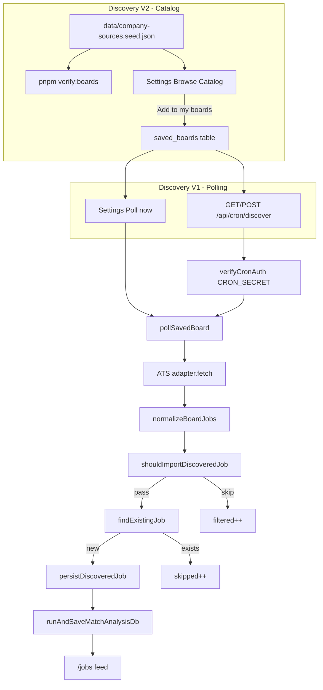

# Automated Job Discovery — Implementation Summary

This document describes what is implemented for **Discovery V1** (user-saved board polling) and **Discovery V2** (verified company catalog). Together they provide structured ATS board discovery — not open-web AI search.

---

## What discovery is (and is not)

| In scope | Out of scope |
|----------|--------------|
| Poll Greenhouse, Lever, and Ashby **boards you choose** | Google / LinkedIn / Indeed crawling |
| Normalize postings → dedupe → match → `/jobs` feed | Auto-apply or login-walled scraping |
| Daily cron + manual “Poll now” | Phase 5 full tracker/Kanban (deferred) |

Discovery imports jobs through the **same pipeline** as manual import: normalize → persist → requirement extraction → match analysis.

---

## Architecture overview



---

## Discovery V1 — Board polling

### Database

**`saved_boards`** ([`src/db/schema.ts`](../src/db/schema.ts))

| Column | Purpose |
|--------|---------|
| `userId` | Owner (RLS-enforced) |
| `companyName` | Display label |
| `boardUrl` | Canonical ATS board URL |
| `provider` | `greenhouse` \| `lever` \| `ashby` |
| `isActive` | Include in cron when `true` |
| `lastPolledAt` | Updated after successful fetch |

**Dedup migration** — [`drizzle/migrations/0005_discovery_dedup.sql`](../drizzle/migrations/0005_discovery_dedup.sql)

```sql
CREATE UNIQUE INDEX IF NOT EXISTS idx_jobs_user_source_job
  ON jobs(user_id, source_job_id)
  WHERE source_job_id IS NOT NULL;
```

Prevents duplicate jobs per user when the same ATS posting is re-imported.

### ATS adapters

Located in [`src/modules/ingestion/`](../src/modules/ingestion/):

| Adapter | File | Public API |
|---------|------|------------|
| Greenhouse | `greenhouse.ts` | `boards-api.greenhouse.io/v1/boards/{slug}/jobs` |
| Lever | `lever.ts` | `api.lever.co/v0/postings/{company}` |
| Ashby | `ashby.ts` | `api.ashbyhq.com/posting-api/job-board/{name}` |

Registered in [`adapters.ts`](../src/modules/ingestion/adapters.ts) with `getAdapterForProvider()` and `detectBestAdapter()`.

### Board-level normalization

[`board-normalize.ts`](../src/modules/ingestion/board-normalize.ts) splits board payloads into individual `NormalizedJob[]` (fixes the old “Multiple Positions” stub for board fetches).

Each job includes: `title`, `company`, `description`, `jobUrl`, `sourceJobId`, `location`, `datePosted` where available.

### Shared persist path

[`persist-job.ts`](../src/modules/ingestion/persist-job.ts)

- `findExistingJob(db, userId, { sourceJobId, jobUrl })` — dedup before insert
- `persistDiscoveredJob(db, userId, normalized, meta)` → `{ jobId, isNew }`

Used by:

- Manual import — `confirmJobImportAction` ([`src/server/actions/index.ts`](../src/server/actions/index.ts))
- Cron / Poll now — [`poll-board.ts`](../src/modules/discovery/poll-board.ts)

Match analysis runs only when `isNew === true`.

### Cron orchestration

| File | Role |
|------|------|
| [`src/app/api/cron/discover/route.ts`](../src/app/api/cron/discover/route.ts) | `GET` and `POST` endpoints |
| [`src/lib/cron-auth.ts`](../src/lib/cron-auth.ts) | `Authorization: Bearer $CRON_SECRET` |
| [`src/lib/cron-discover-handler.ts`](../src/lib/cron-discover-handler.ts) | Load active boards, group by `userId` |
| [`src/db/user-context.ts`](../src/db/user-context.ts) | `withUserDb(userId)` for RLS-safe writes |

**Per-board flow:**

1. `adapter.fetch(boardUrl)` using stored provider hint
2. `normalizeBoardJobs(raw)` → array of jobs
3. Pre-import filter (V2)
4. `persistDiscoveredJob` + `runAndSaveMatchAnalysisDb` for new jobs
5. Update `lastPolledAt` on success

**Rate/cost caps** ([`src/lib/cron-discover.ts`](../src/lib/cron-discover.ts)):

| Constant | Default | Env override |
|----------|---------|--------------|
| `CRON_MAX_BOARDS_PER_RUN` | 20 | — |
| `CRON_MAX_NEW_JOBS_PER_RUN` | 50 | `CRON_MAX_NEW_JOBS_PER_RUN` |
| `CRON_BOARD_DELAY_MS` | 500ms between boards | — |

**Cron response shape:**

```json
{
  "polled": 3,
  "succeeded": 2,
  "failed": 1,
  "newJobs": 12,
  "skipped": 45,
  "matched": 12,
  "filtered": 120
}
```

### Settings UI (V1)

[`settings-client.tsx`](../src/app/(dashboard)/settings/settings-client.tsx)

- Add board manually (URL + provider)
- URL auto-detect via `detectBoardProviderAction`
- Show `lastPolledAt` per board
- Enable / disable, delete, **Poll now**
- Ashby supported in provider select

### Feed integration

- **Source filter** on [`jobs-feed-filters.tsx`](../src/app/(dashboard)/jobs/jobs-feed-filters.tsx): `discovered` vs `manual`
- Inferred from `job_sources.provider` (greenhouse, lever, ashby = discovered)
- **“new” badge** on jobs with `dateDiscovered` within last 24h

### Vercel cron

[`vercel.json`](../vercel.json) — daily at **08:00 UTC** → `/api/cron/discover`

Requires `CRON_SECRET` in environment (you generate this; Vercel sends it automatically on scheduled invocations when set).

---

## Discovery V2 — Company Source Registry

### Design choice

- **JSON seed file first** (no DB table yet)
- Catalog is read-only at runtime; users opt in via **saved_boards**
- Every entry **live-verified** against public ATS APIs

### Seed data

**File:** [`data/company-sources.seed.json`](../data/company-sources.seed.json)

**Schema:** [`data/company-sources.schema.ts`](../data/company-sources.schema.ts) (Zod, shared by app + scripts)

```ts
type CompanyJobSource = {
  id: string;                    // stable key, e.g. "stripe"
  companyName: string;
  atsProvider: "greenhouse" | "lever" | "ashby";
  boardUrl: string;              // canonical normalized URL
  boardSlug: string;             // API token (may differ from company name)
  careersUrl?: string;
  companyWebsite?: string;
  country: "CA" | "US" | "GLOBAL";
  tags: string[];                // e.g. "remote-canada", "frontend-heavy", "fintech"
  enabled: boolean;
  verifiedAt?: string;           // ISO timestamp from verifier
  lastJobCount?: number;
  lastVerifyError?: string;
};
```

**Current catalog (as of last verify):**

| Metric | Count |
|--------|-------|
| Total verified companies | **96** |
| Greenhouse | 59 |
| Ashby | 34 |
| Lever | 3 |
| Canada (`CA`) | 8 |
| US | 38 |
| Global | 50 |

Tags include `remote-canada`, `frontend-heavy`, plus sector tags (`fintech`, `ai`, `saas`, `devtools`, etc.).

Examples: Stripe, Figma, Anthropic, OpenAI, Cursor, Shopify (via catalog entries), Hootsuite, Jobber, 1Password, Wealthsimple, Hopper, and others.

### Board URL normalization

[`board-url.ts`](../src/modules/ingestion/board-url.ts)

- `normalizeBoardUrl(url, provider?)` — canonical board URL
- Strips trailing `/jobs` (e.g. `.../stripe/jobs` → `.../stripe`)
- Supports `job-boards.greenhouse.io` subdomain
- **Rejects single-job URLs** for board polling (must use board root)
- Used in adapters, `addSavedBoard`, and `pollSavedBoard`

### Verification toolchain

| Script | Command | Purpose |
|--------|---------|---------|
| Build from candidates | `pnpm build:seed` | Generate JSON from [`scripts/seed-candidates.ts`](../scripts/seed-candidates.ts) |
| Verify boards | `pnpm verify:boards` | Dry-run: fetch each enabled board, count jobs |
| Write results | `pnpm verify:boards --write` | Update `verifiedAt`, `lastJobCount`; disable failures |
| Single board | `pnpm verify:boards --write --id=stripe` | Re-check one entry |
| Prune | `pnpm prune:seed` | Keep only `enabled && verifiedAt` entries |

Implementation: [`scripts/verify-boards.ts`](../scripts/verify-boards.ts)

### Catalog module

[`company-catalog.ts`](../src/modules/discovery/company-catalog.ts)

- `getCompanySourceCatalog()` — load enabled entries from seed JSON
- `getCatalogEntryById(id)`
- `filterCatalog(entries, { provider, country, tag, search })`

### Settings — Browse catalog

Server actions:

- `getCompanySourceCatalog(filters?)`
- `addSavedBoardFromCatalog(catalogId)` — dedupes if `boardUrl` already saved

UI features:

- Search by company name
- Filter by provider, country, tag
- Verified date + job count badge
- **Add** / **Following** state

### Pre-import cheap filters

[`pre-import-filter.ts`](../src/modules/discovery/pre-import-filter.ts)

`shouldImportDiscoveredJob(job, profile?)` — deterministic, no AI:

**Title rules**

- Allow: frontend, software/product/platform engineer, developer, architect, UI/UX
- Block: sales, recruiter, data scientist, intern, unrelated roles
- Optional: match against profile `targetTitles`

**Location rules**

- Pass: remote, Canada in location/text, `workplaceType === remote`
- Optional: profile `remotePreference`, `preferredLocations`, `location`

Filtered jobs are **not persisted** and **not matched** — they only increment `filtered` in cron stats.

---

## End-to-end user workflow

1. **Onboard** — profile at `/profile`
2. **Discover companies** — Settings → Browse catalog → Add Stripe, Jobber, etc.
3. **Or add manually** — paste board URL (now accepts `.../company/jobs` URLs)
4. **Poll** — “Poll now” or wait for daily cron
5. **Review feed** — `/jobs` with discovered filter, match scores, “new” badge
6. **Re-poll** — dedup prevents duplicates; `skipped` increases

---

## Security and ops

| Concern | Mitigation |
|---------|------------|
| Cron abuse | `CRON_SECRET` bearer token; 503 if unset |
| Cross-user data | Cron writes via `withUserDb(userId)` + RLS |
| Match cost spike | `CRON_MAX_NEW_JOBS_PER_RUN` + pre-import filter + match only new jobs |
| Bad board URLs | `normalizeBoardUrl` validation; verifier disables broken entries |
| Stale catalog | Re-run `pnpm verify:boards --write` periodically |

### Environment variables

| Variable | Required | Notes |
|----------|----------|-------|
| `CRON_SECRET` | Prod cron | You generate (`openssl rand -base64 32`) |
| `CRON_MAX_NEW_JOBS_PER_RUN` | Optional | Default 50 |

### Manual cron test

```bash
source .env.local
curl -X POST "http://localhost:3000/api/cron/discover" \
  -H "Authorization: Bearer $CRON_SECRET"
```

Production:

```bash
curl -X POST "https://job-search-assistant-virid.vercel.app/api/cron/discover" \
  -H "Authorization: Bearer $CRON_SECRET"
```

---

## Tests

| Area | Test file |
|------|-----------|
| Board URL parsing | `src/test/unit/board-url.test.ts` |
| Board normalization | `src/test/unit/board-normalize.test.ts` |
| Ashby adapter | `src/test/unit/ashby-adapter.test.ts` |
| Dedup logic | `src/test/unit/discovery-dedup.test.ts` |
| Persist discovered job | `src/test/integration/discovery-persist.test.ts` |
| Cron stats | `src/test/unit/cron-discover.test.ts` |
| Pre-import filter | `src/test/unit/pre-import-filter.test.ts` |
| Catalog filters | `src/test/unit/company-catalog.test.ts` |

Gate: `pnpm test && pnpm lint && pnpm build` — **108 tests** (107 passed + 1 skipped RLS integration).

---

## Key file index

```
data/
  company-sources.seed.json      # 96 verified companies
  company-sources.schema.ts      # Zod schema

scripts/
  seed-candidates.ts             # Candidate list for build:seed
  build-seed.ts                  # Generate seed JSON
  verify-boards.ts               # Live API verification
  prune-seed.ts                  # Keep verified-only entries

src/modules/ingestion/
  greenhouse.ts, lever.ts, ashby.ts
  board-normalize.ts             # Board → NormalizedJob[]
  board-url.ts                   # URL canonicalization
  persist-job.ts                 # persistDiscoveredJob + dedup
  adapters.ts                    # Registry + detect

src/modules/discovery/
  poll-board.ts                  # Cron + Poll now orchestration
  pre-import-filter.ts           # Cheap filters before persist
  company-catalog.ts             # Load/filter seed JSON

src/lib/
  cron-discover-handler.ts       # Cron entrypoint logic
  cron-discover.ts               # Caps + types
  cron-auth.ts                   # CRON_SECRET check

src/app/
  api/cron/discover/route.ts     # GET + POST
  (dashboard)/settings/          # Catalog + saved boards UI
  (dashboard)/jobs/              # Feed + source filter
```

---

## Deferred (V2.1+)

Not implemented yet; documented for future work:

- DB table `company_job_sources` (dynamic catalog without redeploy)
- Monthly re-verify cron
- Auto-suggest boards from profile tags
- Global poll of registry for all users (still opt-in via saved_boards)
- Phase 5 feed/tracker UX (Kanban, richer filters)

---

## Migrations checklist (Supabase SQL Editor)

Run in order if not already applied:

1. `0002_rls_policies.sql`
2. `0001_indexes.sql`
3. `0003_storage_resumes_bucket.sql`
4. `0004_phase4_qa_tailoring.sql`
5. **`0005_discovery_dedup.sql`** — discovery dedup index

---

## Success criteria (met)

- [x] Save boards in Settings (manual + catalog)
- [x] Poll now / cron imports jobs with match scores
- [x] Re-poll dedupes (no duplicate jobs)
- [x] Discovered jobs usable like manual imports (evidence/match tabs)
- [x] Cron returns `{ newJobs, skipped, matched, filtered }`
- [x] Greenhouse `/jobs` suffix URLs work
- [x] Ashby included (spike passed)
- [x] ~96 verified catalog companies (target ~100–150; expandable via `verify:boards`)
